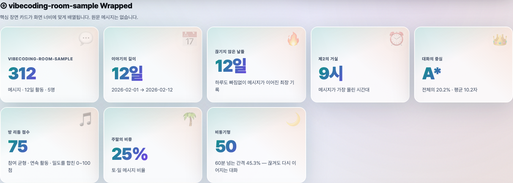
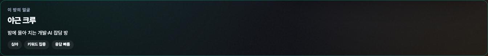
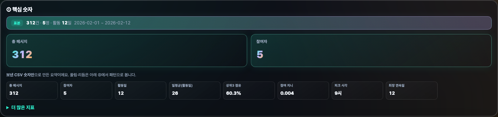
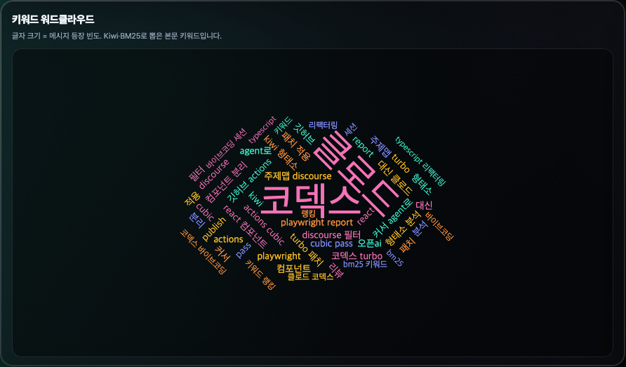

<div align="center">

# KakaoTalk Chat Analyzer

### 카카오톡 CSV 보내기 → 터미널 한 줄 → 브라우저 리포트 링크

[](./LICENSE)
[](https://nodejs.org/)
[](https://claudianus.github.io/kakaotalk-chat-analyzer/)
[](https://www.npmjs.com/package/kcachat)

[**랜딩 (GitHub Pages)**](https://claudianus.github.io/kakaotalk-chat-analyzer/) · [**소스**](https://github.com/claudianus/kakaotalk-chat-analyzer) · [**이슈**](https://github.com/claudianus/kakaotalk-chat-analyzer/issues)

```bash
npx kcachat@latest
```

[Node.js 22+](https://nodejs.org/) · 설치 없이 `npx` · CSV 경로 생략 가능 · [`--local`](#업로드-없이-내-pc에만)

<table>
  <tr>
    <td align="center" width="25%"><strong>Wrapped</strong><br></td>
    <td align="center" width="25%"><strong>Story Deck</strong><br></td>
    <td align="center" width="25%"><strong>① 핵심 숫자</strong><br></td>
    <td align="center" width="25%"><strong>차트</strong><br></td>
  </tr>
</table>

<p><sub><a href="https://claudianus.github.io/kakaotalk-chat-analyzer/#demo">리포트 미리보기 전체</a> (13장 · 탭하면 크게 보기)</sub></p>

</div>

---

## 목차

**처음 쓰는 분**

- [3분 안에 시작하기](#3분-안에-시작하기)
- [리포트에서 볼 수 있는 것](#리포트에서-볼-수-있는-것)
- [개인정보·공유 전에](#개인정보공유-전에)
- [자주 묻는 질문](#자주-묻는-질문)

**더 쓰고 싶을 때**

- [옵션·고급](#옵션고급)
- [최근 업데이트](#최근-업데이트)

**개발자**

- [개발·기여](#개발기여)
- [문서 사이트 (GitHub Pages)](#문서-사이트-github-pages)

---

## 3분 안에 시작하기

### 1. 카카오톡에서 CSV 보내기

1. PC 카카오톡에서 채팅방 열기  
2. **더보기(≡)** → **대화 보내기** → **CSV 보내기**

파일명은 보통 `KakaoTalk_Chat_…` 형태입니다. **원문이 들어 있는 파일**이므로 다른 사람에게 보내기 전에 내용을 확인하세요.

### 2. 터미널에서 한 줄 실행

[Node.js 22+](https://nodejs.org/)가 설치되어 있어야 합니다.

**공유 링크까지 (기본)** — 저장 폴더에서 **가장 최근** CSV를 자동으로 고릅니다:

```bash
npx kcachat@latest
```

**내 PC에만 저장** (인터넷 업로드 없음):

```bash
npx kcachat@latest --local
```

| OS | 자동으로 찾는 폴더 |
|----|-------------------|
| **Windows** | `문서\카카오톡 받은 파일` (없으면 `문서\카카오톡` → `다운로드`) |
| **Mac** | `다운로드` (Downloads) |

다른 폴더를 쓰려면: `KCA_CSV_DIR=~/Desktop npx kcachat@latest`

### 3. 링크 열기

터미널에 나온 **URL**을 브라우저에서 열면 Wrapped·차트·키워드가 있는 리포트를 볼 수 있습니다.

- **최초 1회**는 한국어 분석 모델 다운로드로 **1~3분** 걸릴 수 있습니다.  
- 이미 올린 예전 링크는 **다시 실행·업로드**해야 UI가 바뀝니다.

### 파일을 직접 고르고 싶을 때

```bash
npx kcachat@latest latest --list      # 후보 목록
npx kcachat@latest latest --pick 1    # 두 번째로 최근 파일
npx kcachat@latest "C:\경로\KakaoTalk_Chat_....csv"
```

> 카카오 **공식 앱이 아닙니다.** 보내기 CSV 형식이 바뀌면 동작이 깨질 수 있으니 중요한 대화는 백업해 두세요.

---

## 리포트에서 볼 수 있는 것

브라우저만 있으면 되는 **단일 HTML**입니다. **대화 원문은 파일에 넣지 않습니다.** 상단 **섹션 메뉴**로 ⓪~⑥ 구역을 바로 이동할 수 있습니다.

| 구역 | 내용 |
|------|------|
| **⓪ Wrapped** | 한 장면 요약, 챕터·활동 그리드 |
| **LLM Story Deck** | 방 아키타입, 시즌 에피소드, 캐릭터 카드, 올해의 순간·관계 드라마·방 밈 등 (통계·키워드만 로컬 LLM에 전달, **원문 미전송**) |
| **① 핵심 숫자** | 총 메시지·참여자 히어로 + 핵심 8칸 지표 (`더 많은 지표` 접기) |
| **② 방 이야기** | 규칙/LLM 서사, 인사이트·샵검색·상호작용·주제 제안 |
| **③ 분위기·리듬** | 지니·화자 전환·말풍선 맵 등 패턴 지표 |
| **④ 인터랙티브 차트** | 워드클라우드, 요일·시간대, **주제 맵**(graph·키워드·임베딩 3레인) |
| **⑤ 표·막대** | 키워드 순위(빈도/특이어), 참여자 랭킹 (이름 **마스킹**) |
| **⑥ 용어** | 지표 설명 · 테마 라이트 / 다크 / 시스템 |

LLM이 RAM 부족 등으로 스킵되어도 **규칙 기반 서사**로 리포트는 완성됩니다. 사이드 카드·`#kca-provenance`에서 **LLM 사용 여부**를 확인할 수 있습니다.

공유 링크(BrewPage 등)로 열어도 되고, `--local`로 만든 `index.html`을 더블클릭해도 됩니다.

---

## 개인정보·공유 전에

- 메시지 **본문은 리포트 HTML에 저장하지 않습니다** (집계에만 사용).
- 참여자 이름은 기본적으로 **앞·뒤만 남기고 가운데 마스킹**합니다.
- URL은 **도메인**만 집계합니다.
- 그래도 **키워드·통계**만으로 방 분위기가 드러날 수 있습니다. 링크를 보내기 전에 한 번 훑어 보세요.
- `--local`을 쓰면 기본적으로 **외부 업로드 없이** 내 PC에만 저장합니다.

---

## 자주 묻는 질문

**Q. Node.js가 없어요.**  
→ [nodejs.org](https://nodejs.org/)에서 LTS(22+) 설치 후 터미널을 다시 엽니다.

**Q. CSV를 못 찾는다고 해요.**  
→ 위 [OS별 폴더](#2-터미널에서-한-줄-실행)에 파일이 있는지 확인하거나, 경로를 직접 넣으세요.

**Q. 첫 실행이 너무 느려요.**  
→ Kiwi 한국어 모델을 **처음 한 번** 받는 중입니다. 이후에는 훨씬 빨라집니다.

**Q. 친구에게 링크만내면 되나요?**  
→ 네. 다만 통계·키워드가 방 성격을 드러낼 수 있으니 공유 범위는 스스로 판단하세요.

**Q. 예전에 만든 링크 UI가 옛날이에요.**  
→ 그 링크는 업로드 당시 HTML이 고정됩니다. CSV로 **다시 실행**해 새 링크를 받으세요.

**Q. `kcachat`와 `kakaotalk-chat-analyzer` 차이?**  
→ 같은 프로그램입니다. `kcachat`는 짧은 `npx` 이름입니다.

---

## 옵션·고급

<details>
<summary><strong>CLI 전체 옵션 (펼치기)</strong></summary>

```bash
# 기본: HTML 생성 후 BrewPage 업로드
kca ./KakaoTalk_Chat_....csv

# 업로드 없이 로컬만
kca ./chat.csv --local -o ./report

# 업로드 생략(드라이런)
kca ./chat.csv --dry-run

# 다른 호스트
kca ./chat.csv --host tempfile --ttl 30

# 보내기 구조 점검(원문 출력 없음)
kca inspect ./chat.csv

# 진행률 끄기 / 프로파일
kca ./chat.csv --no-progress
kca ./chat.csv --profile --no-worker

# 날짜 필터
kca ./chat.csv --since 2025-01-01

kca --help
```

업로드가 실패해도 **로컬 `index.html`은 남습니다.**

</details>

<details>
<summary><strong>분석 preset·기능 (0.18+)</strong></summary>

| preset | 용도 | 90k 메시지 목표 | 시맨틱 | 감정 | LLM |
|--------|------|-----------------|--------|------|-----|
| `speed` | RAM·시간 최소 | ~3분 | 끔 | 끔 | 자동( RAM 허용 시 최대 Qwen3.5 ) |
| `balanced` | 기본 권장 | ~5분 | KorSTS / RAM≥16GB·번들 없으면 embed | NSMC | 자동( RAM 허용 시 최대 Qwen3.5 ) |
| `quality` | 한국어·서사 | ~6분 | KoELECTRA embed (번들 ONNX) | NSMC | 자동( 최소 2B, RAM 허용 시 최대 ) |
| `ultra` | 품질 최대(32GB+) | ~9분 | embed + 임베딩 1500~1800건 | NSMC + 독성 ML | 자동( 최소 4B ) |
| `custom` | 기능 직접 지정 | — | env/플래그 | env | 자동( `KCA_LLM=0` 만 끔 ) |

```bash
kca capabilities                    # RAM·추천 preset
kca ./chat.csv --preset balanced
kca ./chat.csv --preset quality --local
kca ./chat.csv --preset ultra --local
kca llm pull                        # RAM 기준 자동 최대 Qwen3.5 GGUF
kca llm pull 4B                     # 수동 size (없으면 분석 시 자동 다운로드)
KCA_LLM_BACKEND=ollama kca ./chat.csv --preset custom
```

환경 변수: `KCA_PRESET`, `KCA_SEMANTIC_MODEL`(Hub id 오버라이드), `KCA_PREFER_BUNDLED_SEMANTIC`(기본 on), `KCA_NO_KURE_DOWNLOAD`(quality/ultra KURE zip lazy 끔), `KCA_SENTIMENT_MODEL`, `KCA_LLM`(기본 on, `0`만 끔), `KCA_LLM_MODEL`(0.8B|2B|4B|9B), `KCA_LLM_BACKEND`, `KCA_LLM_GPU`(`auto`|`metal`|`none`, macOS Metal 호환), `KCA_LLM_GRAMMAR`(기본 on, `0`=prompt-only), `KCA_LLM_MIN_FREE_GB`(LLM 재시도 free RAM 하한, 기본 1.5), `KCA_OLLAMA_MODEL`, `KCA_LLM_MOCK`, `KCA_ONNX_GPU`, `KCA_EMBED_BATCH`, `KCA_SENTIMENT_BATCH`, `KCA_KIWI_WORKERS`, `KCA_NO_KIWI_WORKERS`, `KCA_PROFILE_PHASES`, `KCA_BENCH_CSV`, `KCA_KEYWORD_SUMMARY_TOP`, `KCA_SHOP_SEARCH_TOP`, `KCA_NO_ML_AUTO_INSTALL`, `KCA_SKIP_ML_POSTINSTALL`. (macOS 26 Metal tensor 이슈 시 `GGML_METAL_TENSOR_DISABLE=1` — `auto`에서 기본 설정)

**ML ONNX:** `npm install`·첫 분석 시 `kakaotalk-chat-analyzer-models`(감정 NSMC·KoELECTRA 임베딩) 자동 설치. **quality/ultra**·RAM≥14GB면 **KURE-v1**(~2.1GB)·독성 ONNX도 첫 필요 시 GitHub Release에서 **자동 다운로드**(`~/.cache/kakaotalk-chat-analyzer/ml-models`). 수동 export 불필요. 끄기: `KCA_NO_KURE_DOWNLOAD=1`, `KCA_NO_TOXICITY_DOWNLOAD=1`. zip 미배포 시 KURE는 KoELECTRA embed로 폴백.

**속도(품질 유지):** 대용량 CSV는 Kiwi worker pool(`KCA_KIWI_WORKERS`, RAM≥8GB 기본 2–4)·시맨틱/감정을 키워드 패스와 겹쳐 실행. `KCA_PROFILE_PHASES=1`로 단계별 ms. quality에서 GPU 가속: `onnxruntime-node` 설치 후 `KCA_ONNX_GPU=metal`(macOS)·`cuda`(Linux)·`dml`(Windows).

**키워드:** 요약은 `KCA_KEYWORD_SUMMARY_TOP`(기본 12)·**빈도 순**; ④ 차트에서 **빈도/특이어** 탭 전환. 전체 ~120개는 집계 상한.

**주제 맵:** graph(공기 군집)·keyword(상위 키워드 시드)·semantic(임베딩 클러스터) 3레인 RRF 병합 — 대용량 방에서 의미 테마 최대 12장. `KCA_TOPIC_MAX`, `KCA_TOPIC_MIN_THEMES`.

**LLM (자동, `KCA_LLM=0` 제외):** RAM이 허용하는 최대 Qwen3.5(0.8B→9B)로 주제 제목·서사 + Story Deck(방 아키타입·올해의 순간·에피소드·관계 드라마·밈·공유 문구 등, 원문 미전송). node-llama-cpp **JSON Schema grammar**로 출력 형식을 강제(기본 on). LLM 실패 시에도 리포트는 규칙 기반 서사로 완성.

**LLM 문제 해결:** 0.20+ 부터 GGUF 추론은 **자식 프로세스**에서 실행되어 Metal/GGUF 네이티브 크래시(SIGSEGV)가 나도 리포트는 규칙 서사로 **끝까지 완료**됩니다. 크래시 시 CPU·소형 모델로 자동 재시도합니다. free RAM이 매우 낮으면(`KCA_LLM_MIN_FREE_GB` 미만) JSON 재시도만 skip. LLM을 끄려면 `KCA_LLM=0 npx kcachat --local`. 고급: `KCA_LLM_GPU=none`(CPU 고정), `KCA_LLM_MODEL=0.8B`, `KCA_LLM_IN_PROCESS=1`(디버그·비권장). JSON만 끄려면 `KCA_LLM_GRAMMAR=0`.

</details>

<details>
<summary><strong>성능·키워드·벤치 (개발·파워유저)</strong></summary>

- **스트리밍 파싱**: 대용량 CSV도 RAM에 통째로 올리지 않음  
- **진행률**: 기본 ON (`--no-progress`로 끔)  
- **시맨틱 키워드**: 한국어 방 기본 ON (`--no-semantic-keywords`로 끔)  
- CSV 옆 **`.kca-glossary.txt`**(한 줄에 한 단어) → Kiwi 사용자 사전 반영  

```bash
npx kcachat@latest "./chat.csv" --profile --no-worker
npm run bench:stream -- 100000   # 저장소 클론 후
npm run bench:preset             # speed/balanced SLA 스모크
KCA_BENCH_COMPARE=1 npm run bench:semantic
```

</details>

**버전 고정:** `npx kakaotalk-chat-analyzer@0.20.0` · 최신은 `kcachat@latest`가 매번 본체를 받습니다. 리포트 사이드 카드·`#kca-provenance`로 실제 생성 버전을 확인할 수 있습니다.

**로컬 개발:**

```bash
git clone https://github.com/claudianus/kakaotalk-chat-analyzer.git
cd kakaotalk-chat-analyzer && npm install && npm run build && npm test
```

---

## 최근 업데이트

| 버전 | 요약 |
|------|------|
| **0.21.1** | **KURE·독성 ONNX** 첫 사용 시 Release **자동 다운로드**(CI 업로드)·GitHub API 폴백 URL |
| **0.21.0** | **`ultra` preset**·quality/ultra **KURE-v1** 로컬 ONNX lazy(Release zip)·KoELECTRA embed 폴백·preset별 시맨틱·독성 ML on(ultra) |
| **0.20.0** | **LLM child 프로세스 격리** — Metal/GGUF SIGSEGV도 리포트 완료·CPU·소형 모델 자동 재시도·post-ML free RAM GPU 정책 |
| **0.19.12** | **LLM Story Deck**(아키타입·에피소드·캐릭터·올해의 순간·관계 드라마·방 밈·공유 문구)·**슬림 ① 핵심 숫자**·중복 차트·규칙 페르소나 제거·섹션 ⓪~⑥ 내비 |
| **0.19.11** | `llm_retry` 예산을 실제 재시도 모델 크기에 맞춤 |
| **0.19.10** | LLM 재시도 RAM gate·JSON 벤치·테스트 보강 |
| **0.19.9** | JSON Schema grammar·OOM 방어 — LLM 실패해도 리포트 완성 |
| **0.19.8** | SLA cap 기준 LLM 예산 skip 완화 |
| **0.19.7** | 가용 RAM 모델 선택·타임아웃 분리·JSON 재시도 |
| **0.19.6** | macOS Metal 폴백·로드 시점 RAM 기준 Qwen 선택 |
| **0.19.5** | KoELECTRA NSMC·embed ONNX npm 번들 자동 설치·독성 lazy zip·Hub 폴백 정리 |
| **0.19.4** | Qwen3.5 RAM greedy 자동 선택·모든 preset LLM on |
| **0.18.2** | 주제 맵 3레인(graph·키워드·임베딩) 병합·테마 6~12·LLM `topicProposals` |
| **0.18.1** | 키워드 빈도/특이어 dual-view·샵검색 통계·dyad 셀 숫자·LLM 인사이트 필드 |
| **0.18.0** | preset(speed/balanced/quality)·5분 예산 skip·LLM 서사·KLUE 감정·dual-lane 툴팁·CI Playwright |
| **0.17.2** | `kca llm pull`·provenance `llmUsed`·분석 예산 라우터 |
| **0.16.6** | 글자 수 랭킹·비속어 패턴 통계·transformers 감정 분석(자동/선택) |
| **0.16.5** | 상호작용 히트맵: 말 많은 사람 축 상단·지연 로드·로딩 스켈레톤 |
| **0.16.4** | 대용량 방 키워드: minDf 스케일·메시지 수 우선 정렬·시맨틱은 BM25 후보만 보강 |
| **0.16.3** | 기본 **품질 우선** 프로필(메인 스레드·시맨틱 샘플 확대·RRF 완화·임베딩 주제). 가속은 `--worker` / `--fast` |
| **0.16.1** | Windows 기본 CSV 폴더 `문서\카카오톡 받은 파일` |
| **0.16.0** | 경로 생략·`latest --list/--pick`·진행률 추정·세션 gap |
| **0.15.0** | 모바일 참여자 카드·키워드 RRF·오픈채팅 인사이트 |
| **0.13.8** | burst·주제맵·벤치 UI |
| **0.13.3** | 리포트에 `kca` 버전(provenance) 표시 |

이전 버전: [Releases](https://github.com/claudianus/kakaotalk-chat-analyzer/releases)

---

## 개발·기여

```bash
npm install && npm run build && npm test
```

유용한 스크립트: `report:qa` · `report:screenshots` · `docs:capture-demo` · `bench:stream`

이슈·PR 환영합니다. 민감한 CSV·토큰은 이슈에 첨부하지 마세요.

**아키텍처 (요약):** CSV 스트림 → 집계(본문 비보관) → 단일 HTML → [선택] BrewPage 등 업로드.

---

## 문서 사이트 (GitHub Pages)

- **공개 URL:** [https://claudianus.github.io/kakaotalk-chat-analyzer/](https://claudianus.github.io/kakaotalk-chat-analyzer/)
- [`docs/index.html`](docs/index.html) — 시작 명령·OS별 폴더·짧은 팁
- `main`에 `docs/` 푸시 시 Actions가 배포 · pill 버전: `node scripts/sync-docs-version.mjs`

---

## 라이선스

[MIT License](./LICENSE)

<div align="center">

**Made with care for safer chat analytics** · [@claudianus](https://github.com/claudianus)

</div>
