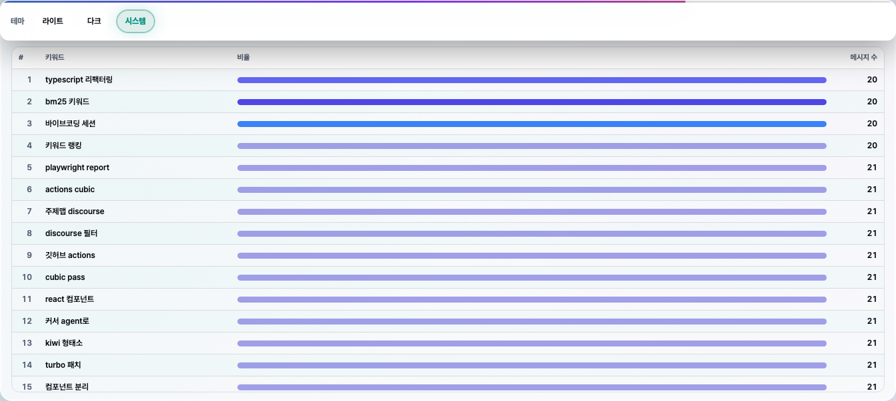

<div align="center">

# KakaoTalk Chat Analyzer

### 카카오톡 CSV 보내기 → 익명 집계 리포트 → 선택적 임시 공유 · 한 번에 끝내는 CLI

[](./LICENSE)
[](https://nodejs.org/)
[](https://claudianus.github.io/kakaotalk-chat-analyzer/)
[](https://www.npmjs.com/package/kcachat)
[](https://www.npmjs.com/package/kakaotalk-chat-analyzer)

[**랜딩 (GitHub Pages)**](https://claudianus.github.io/kakaotalk-chat-analyzer/) · [**소스 코드**](https://github.com/claudianus/kakaotalk-chat-analyzer) · [**이슈**](https://github.com/claudianus/kakaotalk-chat-analyzer/issues)

카카오톡 **CSV 보내기** → 터미널 **한 줄** → 브라우저에서 읽는 Wrapped·차트 리포트 링크.

```bash
npx kcachat@latest
```

[Node.js 22+](https://nodejs.org/) · CSV 생략 시 `KCA_CSV_DIR` 기본 폴더(Win: `Documents\카카오톡 받은 파일`, macOS: Downloads) · `--local` ([빠른 시작](#빠른-시작))

<table>
  <tr>
    <td align="center" width="33%"><strong>Wrapped</strong><br></td>
    <td align="center" width="33%"><strong>차트</strong><br></td>
    <td align="center" width="33%"><strong>키워드</strong><br></td>
  </tr>
</table>

<p><sub>미리보기는 테스트 fixture 리포트 캡처입니다. UI 변경 후 <code>npm run docs:capture-demo</code>로 갱신.</sub></p>

</div>

---

## 목차

- [왜 이 프로젝트인가요?](#왜-이-프로젝트인가요)
- [핵심 기능](#핵심-기능)
- [대용량·속도](#대용량속도)
- [리포트 UX](#리포트-ux)
- [카카오톡에서 CSV 보내기](#카카오톡에서-csv-보내기)
- [빠른 시작](#빠른-시작)
- [생성되는 리포트](#생성되는-리포트)
- [프라이버시 기본값](#프라이버시-기본값)
- [아키텍처 한눈에](#아키텍처-한눈에)
- [개발](#개발)
- [문서 사이트 (GitHub Pages)](#문서-사이트-github-pages)
- [기여하기](#기여하기)

---

## 왜 이 프로젝트인가요?

카카오톡 대화를 **CSV로 보낸 뒤**, 팀·친구·커뮤니티에 **재미있는 통계**를 공유하고 싶을 때가 있습니다.  
그런데 원문 그대로 올리기엔 **개인정보·민감 URL** 리스크가 큽니다.

**`kca`(KakaoTalk Chat Analyzer)**는 메시지 본문을 **리포트 파일에 저장하지 않고**, 집계 통계만 담은 **단일 `index.html`**을 생성합니다. 몇 개월·수십만 줄 규모도 **파일 전체를 RAM에 올리지 않는 스트리밍 집계**로 처리하고, 리포트는 **한글 프리미엄 UI**(채팅방 이름·히트맵·오전/오후 리듬·인사이트 카드)로 바로 읽을 수 있습니다. 기본은 참여자 **부분 마스킹**, 필요 시 **가입 없이** BrewPage 등에 올려 링크로 공유합니다.

> 이 도구는 카카오 공식 제품이 아닙니다. 보낸 CSV 형식 변경에 따라 파싱이 깨질 수 있으니, 중요한 데이터는 항상 백업하세요.

---

## 핵심 기능

| 영역 | 설명 |
|------|------|
| **인코딩** | UTF-8 BOM, UTF-8, CP949/EUC-KR 등 보내기 인코딩 자동 감지 |
| **파싱** | `Date,User,Message` 헤더 기반 CSV + 멀티라인 메시지 처리 |
| **리포트** | Wrapped·**ECharts**·**주제 맵**(c-TF-IDF)·**Kiwi+BM25** 키워드 120개·잔디·인사이트 등 **집계 전용** 시각화 |
| **성능** | 줄 단위 스트림 파싱 · 단일 패스 집계 · 3MB+ Worker · 진행률 **기본 ON** (`--no-progress`로 끔) |
| **배포** | BrewPage(기본) / TempFile / Cloudflare 등 **TTL 기반** 임시 호스팅 · iframe 공유 링크 안전 처리 |
| **npx** | 짧은 별칭 **[`kcachat`](https://www.npmjs.com/package/kcachat)** 또는 본체 **`kakaotalk-chat-analyzer`** |
| **프라이버시** | 원문 미포함, 참여자 **부분 마스킹 표시명**(기본), URL은 **도메인**만 집계 |

---

## 대용량·속도

카카오 보내기 CSV는 **일반 표 CSV가 아니라** “날짜 줄 + 이어지는 본문” 형식입니다. `kca`는 이 형식에 맞춘 **전용 스트림 파서**로 읽고, 메시지마다 통계만 누적한 뒤 **본문은 즉시 버립니다**.

| 설계 | 효과 |
|------|------|
| **스트리밍 파싱** | 파일 전체를 문자열/배열로 펼치지 않음 |
| **단일 패스 집계** | `Map`·히스토그램·온라인 통계(간격 P90 등)만 유지 |
| **Worker (≥3MB)** | 대용량일 때 메인 스레드 멈춤 완화 |
| **키워드** | **Kiwi** 한국어 형태소(+방별·glossary userWords) + **BM25**·PMI + **한국어 방 자동 시맨틱**(다국어 임베딩) |
| **kcachat@latest** | 실행 시 `kakaotalk-chat-analyzer@latest` 본체를 받아 최신 CLI 사용 |

로컬 벤치(합성 20만 메시지, 집계만): **약 0.4초대** — 환경·디스크·실제 대화 밀도에 따라 달라집니다.

```bash
# 진행률은 기본으로 stderr에 표시 (집계 → Kiwi 준비 → 키워드·주제). 끄려면:
npx kcachat@latest "./KakaoTalk_Chat_....csv" --no-progress

# 한국어 방은 시맨틱 키워드가 기본 ON (multilingual-e5-small, 끄려면 --no-semantic-keywords)
# 영어 위주 방에서 강제: --semantic-keywords
# 이전 MiniLM: KCA_SEMANTIC_MODEL=Xenova/paraphrase-multilingual-MiniLM-L12-v2

# 단계별 ms (Worker 끔)
npx kcachat@latest "./KakaoTalk_Chat_....csv" --profile --no-worker

# 개발용 벤치
npm run bench:stream -- 100000
```

> 외부 DB(DuckDB 등) 없이 **Node.js만**으로 동작합니다. 의존성·설치 부담을 줄이기 위한 선택입니다.

---

## 리포트 UX

생성되는 `index.html`은 **브라우저만** 있으면 열리는 단일 파일입니다. (인터랙티브 차트는 CDN으로 ECharts를 불러옵니다.)

- **⓪ Wrapped · 스토리**: 카드형 한 장면 요약, **페르소나·챕터**, **활동 기간/연간 그리드**(짧은 기간은 「활동 기간 그리드」), **이벤트 스파인**, 방 프로필·타임라인
- **빠른 이동**: Wrapped · 페르소나 · 연간 그리드 · 숫자 요약 · 하이라이트 · 주제 맵 · 인터랙티브 차트 · 용어 설명
- **혁신 레이어**: **dyad**(누가 누구에게 답하는가)·기간 비교·내러티브·브러시 기간 탐색
- **인터랙티브 차트**: 워드클라우드, 시간대·**요일 7색**·월별, **대화 테마 · c-TF-IDF**, **키워드 순위 목록**(인라인 막대·전체 120개)
- **숫자·인사이트**: 지니·리듬 점수·응답 간격(초/분)·하이라이트·시스템 알림 분리
- **키워드**: **Kiwi** + **BM25/PMI** + 한국어 방 **자동 시맨틱**(e5-small), 오픈채팅·잡음어 필터
- **참여자**: 말풍선 맵 + 마스킹 닉네임 + 랭킹 테이블
- **생성 메타 (0.13.3+)**: 사이드 카드 **생성 도구**(`kca` 버전), 접기 **리포트 정보**, `#kca-provenance` JSON — BrewPage 링크로 **어떤 kca로 만들었는지** 확인 가능
- **BrewPage**: iframe 섹션 점프·외부 링크 안전 처리
- **테마**: 라이트 / 다크 / 시스템 · **OLED glass** 비주얼

원문 메시지·전체 URL은 HTML에 넣지 않습니다(BrewPage 5MiB 한도 고려). **이미 올린 링크는 재업로드해야** UI·버전 메타가 바뀝니다.

### 최근

| 버전 | 요약 |
|------|------|
| **0.16.1** | Windows 기본 CSV 경로 `Documents\카카오톡 받은 파일` 자동 탐색 |
| **0.16.0** | **최신 CSV 자동**(`npx kcachat`·`latest --list/--pick`)·진행률 추정·30분 세션 gap·topicModel provenance·Facts/Wrapped DOM 정렬 |
| **0.15.0** | Trust UX(조건부 네비·참여자 카드)·키워드 RRF·burst MAD·Kiwi 1×CSV read·오픈채팅 인사이트·임베딩 주제 옵션 |
| **0.13.8** | burst 활동일 스케일·대용량 gap exact quantile·주제맵 PMI/약한 edge·벤치 **추정** UI·회귀 fixture |
| **0.13.7** | **BM25** 키워드·**담화어** 통합 lexicon·주제맵 discourse 게이트·시맨틱 k-means++/coherence·타임라인 meme **peakDate** |
| **0.13.6** | 활동 그리드 일별 셀·dyad 전체 숫자·주제맵 품질·키워드 요약 펼침·샵검색 집계·시스템 테마 |
| **0.13.5** | 키워드 **순위 목록** 통합(ECharts 막대+표 → 인라인 막대 표) · ② 요약 상위 12·접기 기본 |
| **0.13.4** | Worker 분석 시 provenance **`kiwiAvailable`** 정확 표시 (`kiwiAvailableAtAnalysis`) |
| **0.13.3** | HTML **provenance**: `kca` 버전·`#kca-provenance` JSON·**리포트 정보** `<details>`·`kcachat` → `KCA_INVOKER` |
| **0.13.2** | 키워드 막대 insideLeft·상위 3색, **활동 기간 그리드**(compact), 주제 테마/기간 분리, dyad visualMap |
| **0.13.1** | 생성 시각·소요, 이벤트 스파인, 히트맵/참여 pie, 주제맵·키워드 UX |
| **0.13.0** | dyad·타임라인·내러티브·기간 탐색(혁신 레이어) |
| **0.12.0** | OLED glassmorphism 리포트 비주얼 |
| **0.11.2** | lazy charts·Playwright `report:screenshots` |
| **0.11.1** | ECharts 반응형 grid·모바일 말풍선·`npm run report:viewport` |
| **0.11.0** | 반응형 6레이어·ResizeObserver·스크롤 리빌 |
| **0.10.x** | Open Props CSS 번들·테마 대비·Pretendard ([Releases](https://github.com/claudianus/kakaotalk-chat-analyzer/releases)에서 0.10.0–0.10.2) |
| **0.9.x** | e5-small 시맨틱 기본·스크롤 스파이 네비 ([Releases](https://github.com/claudianus/kakaotalk-chat-analyzer/releases)) |
| **0.3–0.8** | Kiwi·BM25·주제 맵·한국어 시맨틱·스트림 2단계 등 — [Releases](https://github.com/claudianus/kakaotalk-chat-analyzer/releases) 참고 |

---

## 카카오톡에서 CSV 보내기

1. 카카오톡에서 분석할 **채팅방**을 엽니다.
2. 우측 상단 **더보기(≡)** → **대화 보내기** → **CSV 보내기**로 파일을 저장합니다. (파일명은 보통 `KakaoTalk_Chat_…` 형태입니다.)
3. 아래 [빠른 시작](#빠른-시작)의 `npx` 명령에 **저장한 파일 경로**를 넣어 실행합니다.

> iOS/Android 앱 버전에 따라 메뉴 문구가 조금 다를 수 있습니다. **메시지 원문이 포함된 CSV**이므로, 공유·업로드 전에 항상 내용을 확인하세요.

---

## 빠른 시작

### 요구 사항

- [Node.js](https://nodejs.org/) **22 이상**

### npx 한 줄 (추천)

**짧은 패키지명 [`kcachat`](https://www.npmjs.com/package/kcachat)** 으로 본체(`kakaotalk-chat-analyzer`)와 똑같이 실행할 수 있습니다.

| 상황 | 대략 소요 (M1급, 참고) |
|------|------------------------|
| 최초 `npx` + Kiwi 모델 | 1~3분 (1회) |
| 2천 건 · `--local` · 시맨틱 끔 | 수 초 |
| 9만 건 · Kiwi ON · 시맨틱 ON | 수십 초~2분 |

**로컬에만** (`--local`: HTML만 만들고 기본 BrewPage 업로드는 생략. 출력 기본 `.tmp/kca-report`, `-o ./report`로 변경):

```bash
npx kcachat@latest --local
# 또는 경로 지정: npx kcachat@latest "./KakaoTalk_Chat_....csv" --local
```

**리포트 생성 후 기본 호스트(BrewPage)로 업로드** (CSV 생략 시 **KCA_CSV_DIR** 또는 OS 기본 폴더에서 최신 `KakaoTalk*.csv` 자동 선택):

| OS | 기본 폴더 |
|----|-----------|
| Windows | `%USERPROFILE%\Documents\카카오톡 받은 파일` |
| macOS 등 | `~/Downloads` |

```bash
npx kcachat@latest
npx kcachat@latest latest --list    # 후보 10개 목록
npx kcachat@latest latest --pick 1  # 두 번째로 최근 파일
KCA_CSV_DIR=~/Desktop npx kcachat@latest
```

> **버전:** `kcachat@latest`는 본체 `kakaotalk-chat-analyzer@latest`를 매 실행 받습니다. 고정하려면 `npx kakaotalk-chat-analyzer@0.13.4`. 리포트 사이드 카드·`grep kca-provenance`로 실제 생성 버전을 확인하세요. 오프라인은 `kcachat … --bundled`. ([kcachat README](kcachat/README.md))

CSV와 같은 폴더에 **`.kca-glossary.txt`**(한 줄에 한 단어)를 두면 Kiwi 사용자 사전에 자동 반영됩니다.

전체 이름으로 실행해도 동일합니다:

```bash
npx kakaotalk-chat-analyzer@latest "./KakaoTalk_Chat_....csv" --local
```

GitHub 소스에서 직접:

```bash
npx github:claudianus/kakaotalk-chat-analyzer "./KakaoTalk_Chat_....csv" --local
```

### 로컬 클론 개발

```bash
git clone https://github.com/claudianus/kakaotalk-chat-analyzer.git
cd kakaotalk-chat-analyzer
npm install
npm run build
npm test
```

### CLI 요약

기본 동작은 **서브커맨드 없이** `<csv>` 한 개만 주면 됩니다.

```bash
# 기본: HTML 생성 후 BrewPage 업로드
kca ./KakaoTalk_Chat_....csv

# 업로드 없이 로컬만
kca ./KakaoTalk_Chat_....csv --local -o ./report

# 업로드 생략(드라이런)
kca ./KakaoTalk_Chat_....csv --dry-run

# TempFile 호스트
kca ./chat.csv --host tempfile --ttl 30

# 보내기 구조 점검(원문 출력 없음, 스트리밍)
kca inspect ./KakaoTalk_Chat_....csv

# 진행률 끄기(CI·스크립트) / 단계별 ms 프로파일
kca ./chat.csv --no-progress
kca ./chat.csv --profile --no-worker

# YYYY-MM-DD 이후만 집계
kca ./chat.csv --since 2025-01-01

kca --help
```

업로드가 실패해도 **로컬 `index.html`은 남습니다**.

---

## 생성되는 리포트

- **단일 `index.html`**: CSS·차트·안내 문구가 **한 파일에 포함**되어 오프라인에서도 동작합니다.
- **원문 미저장**: 메시지 본문은 통계 계산에만 사용되며 HTML에 남기지 않습니다.
- **provenance (CLI)**: `kca` 버전·분석 옵션·HTML 크기·생성 소요가 **생성 도구** / **리포트 정보** / `#kca-provenance`에 기록됩니다.
- **재업로드 안내**: 예전 BrewPage 링크는 생성 시점 HTML이 고정됩니다. UI·버그 수정 후에는 **다시 업로드**해야 반영됩니다.
- 자세한 화면 구성은 [리포트 UX](#리포트-ux)를 참고하세요.

---

## 프라이버시 기본값

- 기본(`public-masked`)은 참여자 이름을 **앞·뒤 글자만 남기고 가운데 마스킹**합니다(동명이의 충돌 시 `·2`처럼 구분자가 붙을 수 있음). 완전 별칭(`User 001`)은 `--privacy public-anonymous` 로 선택할 수 있습니다.
- 메시지 텍스트는 **통계 계산에만** 사용되며, **생성된 HTML에 원문이 쓰이지 않습니다**.
- URL에서 **도메인**만 집계하고, 전체 URL 문자열은 리포트에 보존하지 않습니다.
- BrewPage **owner 토큰**은 로컬에 저장되어, 이후 링크 관리·삭제에 활용할 수 있습니다.

```bash
# 저장된 owner 토큰 삭제
kca token clear --host brewpage --ns kakao-chat-report
```

---

## 아키텍처 한눈에

```
CSV 파일 (스트림 read)
   → 인코딩 샘플(512KB) + 줄 단위 Kakao 파서
   → ReportAggregator (단일 패스 · 메시지 본문 비보관)
        ├─ [≥3MB] Worker 스레드 (선택)
        └─ Gap/키워드 온라인 통계
   → report.ts (단일 HTML, 다크/라이트)
   → [선택] providers → BrewPage / TempFile / Cloudflare
```

`kcachat`는 npm에서 **짧은 이름**으로 위 파이프라인을 실행하는 래퍼입니다.

---

## 개발

```bash
npm install
npm run build   # sync-version → CSS 번들 → tsc
npm test
```

유용한 스크립트: `npm run report:qa` · `report:qa:serve` · `report:screenshots` · `docs:capture-demo` · `keyword:audit` · `bench:stream` · Pages pill `node scripts/sync-docs-version.mjs`

---

## 문서 사이트 (GitHub Pages)

### Kiwi 모델·환경 변수

- **최초 실행** 시 GitHub에서 Kiwi 한국어 모델을 **무료**로 받아 `~/.cache/kakaotalk-chat-analyzer/kiwi-base/`에 둡니다.
- **`KCA_NO_KIWI=1`**: 형태소 없이 휴리스틱만(빠름, 품질↓).
- **진행률**: 기본으로 stderr에 `대화 분석 42% (…)` 표시. 끄려면 `--no-progress`.
- **키워드 비교**: `npm run keyword:diff -- ./KakaoTalk_Chat_....csv 30`
- LGPL 고지: [THIRD_PARTY_NOTICES.md](THIRD_PARTY_NOTICES.md)

랜딩([`docs/index.html`](docs/index.html))은 **업로드 한 줄 명령**·**리포트 데모 스크린샷**·짧은 팁만 담은 단일 HTML입니다. 상세 옵션은 이 README를 봅니다. `main`에 `docs/` 변경을 푸시하면 **GitHub Actions**가 Pages를 배포합니다.

- **공개 URL:** [https://claudianus.github.io/kakaotalk-chat-analyzer/](https://claudianus.github.io/kakaotalk-chat-analyzer/)
- **워크플로:** [`.github/workflows/pages.yml`](.github/workflows/pages.yml)

### 저장소를 새로 쓸 때 (Pages 켜기)

1. GitHub **Settings → Pages**
2. **Build and deployment → Source:** **GitHub Actions** 선택
3. `main`에 푸시하면 **Deploy GitHub Pages** 워크플로가 `docs/`를 게시합니다. (최초 1회는 Actions 탭에서 권한/환경 승인이 필요할 수 있습니다.)

---

## 기여하기

이슈·PR·아이디어 모두 환영합니다. 큰 변경 전에는 이슈에서 방향을 먼저 짧게 나누면 리뷰가 빨라집니다.

1. Fork → 브랜치 생성  
2. `npm test` 통과  
3. PR 설명에 **동기(왜)** 와 **테스트 방법**을 적어 주세요.

---

## 보안

민감한 CSV나 토큰이 포함된 스크린샷은 **이슈/PR에 첨부하지 마세요**.  
취약점으로 보이는 내용은 비공개 채널(예: GitHub Security Advisories)로 알려 주시면 감사하겠습니다.

---

## 라이선스

[MIT License](./LICENSE)

---

<div align="center">

**Made with care for safer chat analytics** · [@claudianus](https://github.com/claudianus)

⭐ 이 프로젝트가 도움이 되었다면 스타 한 번 부탁드립니다.

</div>
