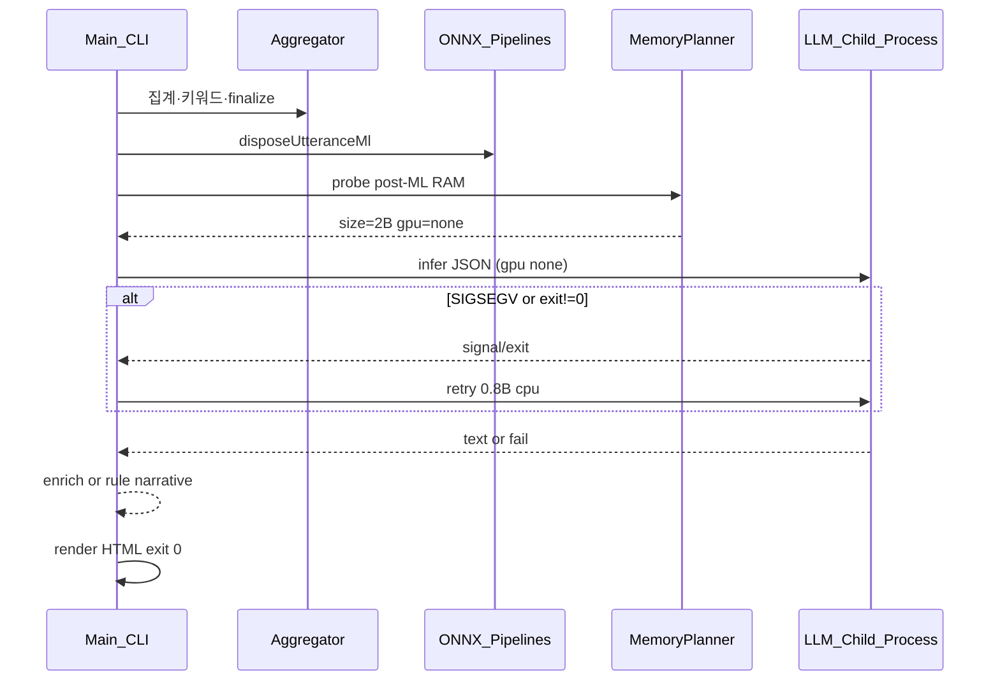

# LLM 런타임 복원력 설계 (SIGSEGV·RAM·무음 종료 근본 해결)

**상태:** P0 구현 완료 (child 격리·GPU 정책·fallback ladder) — P1 memory-plan·provenance 타임라인은 후속  
**작성:** 2026-05-19  
**트리거:** `npx kcachat@latest` · quality preset · ~97k 메시지 · `LLM 서사 0%` 직후 프로세스 종료 (재현: exit 139, Metal + Qwen 4B/9B)

---

## 1. 문제 정의

### 1.1 사용자가 본 현상

| 로그 | 의미 |
|------|------|
| `독성 워밍업 건너뜀: Unauthorized…` | **무관** — gated HF 모델 스킵, lexicon 폴백 |
| `키워드·주제 99%` | 집계·ML·키워드 **완료** |
| `리포트 마무리 0%` / `LLM 서사 0%` | `finalize()` 직후 LLM 단계 **진입 직후** |
| `✘ 1` · `[kca] 완료` 없음 | **분석 파이프라인 미완료** (업로드·HTML 미생성 가능) |

### 1.2 근본 원인 (재현·코드 검증)

1. **SIGSEGV는 JavaScript로 잡을 수 없음**  
   `node-llama-cpp` → llama.cpp 네이티브가 **메인(또는 analyze-worker) 프로세스**에서 GGUF 로드·Metal 추론 시 세그폴트 → `process.exit(139)` 또는 셸이 `1`로 표시.

2. **설계상 “LLM 실패 = skip”이지만 “프로세스 사망 = 전체 실패”**  
   `runLlmPhaseIfAllowed` / `applyLlmEnrichment`의 `try/catch`는 **V8 예외만** 처리. 네이티브 크래시 시 리포트 HTML·`완료` 로그·BrewPage 업로드까지 모두 중단.

3. **RAM 플래너와 실제 피크 불일치**  
   LLM 모델 크기는 분석 초반 `available − 고정 reserve(6~8GB)`로 4B/9B 선택. ONNX(감정·임베딩)·Kiwi·집계 **피크 이후** `dispose`해도 OS `free` 회수 지연·Metal VRAM 잔류 → **로드 시점 OOM/Metal 버그** 유발.

4. **Metal 완화가 불완전**  
   `GGML_METAL_TENSOR_DISABLE=1`은 `auto`·darwin에만 적용. **init 실패**만 CPU 폴백; **load/prompt 중 segfault**는 폴백 없음. `KCA_LLM_GPU=metal`이면 tensor disable 미적용.

### 1.3 성공 기준 (프로젝트 SLA)

| # | 기준 |
|---|------|
| S1 | LLM·Metal·OOM·segfault 어떤 경우에도 **분석 프로세스가 비정상 종료되지 않음** (exit 0, 리포트 HTML 생성) |
| S2 | LLM 불가 시 **규칙 기반 서사**로 완료 + `summary.llmSkippedReason`·stderr에 **한글 원인** |
| S3 | quality · 90k+ 메시지 · macOS 26GB급 RAM에서 **기본 npx 경로** 재현 테스트 통과 |
| S4 | provenance에 **단계별 RAM·선택 모델·백엔드·fallback 이력** |
| S5 | 회귀: `npm test` + LLM child mock + (선택) macOS CI smoke |

---

## 2. 전문가 집단 페르소나 · 책임 분담

다음 6역할을 **병렬 워크스트림**으로 투입한다. 구현 시 서브에이전트/PR 단위를 역할별로 쪼갠다.

### 2.1 🔧 Reliability Lead (SRE) — **워크스트림 A: 프로세스 격리**

**미션:** 네이티브 크래시를 **자식 프로세스 경계**로 가둔다.

- `runLlamaPrompt` → **전용 child** (`node dist/src/llm-infer-cli.js` 또는 `fork` + IPC)
- 프로토콜: stdin/stdout **JSON Lines** `{ modelPath, prompt, gpu, timeouts, sampling }` → `{ ok, text }` | `{ error, code, signal }`
- 부모: `exit code !== 0` · `signal SIGSEGV` → `inference_error` + **자동 1회 재시도** (`gpu: none`, 또는 한 단계 작은 모델)
- analyze-worker 경로: worker **내부**에서 child spawn (worker가 죽지 않게)
- **절대 규칙:** child 실패 ≠ 부모 `process.exit(1)`

**산출물:** `src/llm-infer-child.ts`, `src/llm-subprocess.ts`, `test/llm-subprocess.test.ts`

---

### 2.2 🧠 ML Platform Engineer — **워크스트림 B: 통합 메모리 플래너**

**미션:** ONNX peak → dispose → GGUF load를 **한 타임라인**으로 계획한다.

- `MemoryPlan` 타입 + `planLlmAfterMl(profile, phases, messageCount)`
- 단계 예약: `onnxFootprintGb(sentiment, semantic, toxicity, batch)` + `kiwiGb` + `aggSpoolGb` + `ggufRssGb(size, ctx=4096)` + `osSlackGb(2)`
- **선택 시점:** LLM 크기는 **ML dispose 직후 `probeMachineProfileSync()`** 만 사용 (분석 시작 시 plan은 “예상”만)
- `pickLargestQwen35ForRam(effectiveHeadroom)` 에서 `effectiveHeadroom = min(available, free+reclaimCap) - ggufRss(next) - slack`
- `free < KCA_LLM_MIN_FREE_GB` → **자동 downgrade** (9B→4B→2B→0.8B→off)
- `AnalysisBudgetTracker.updateLlmSize` ↔ post-ML plan **단일 소스**

**산출물:** `src/memory-plan.ts`, `llm-resolve.ts` 리팩터, `test/memory-plan.test.ts`

---

### 2.3 🍎 Native/macOS Engineer — **워크스트림 C: GPU 정책**

**미션:** Metal을 “빠르지만 불안정”으로 취급하고 **안전 기본값**을 만든다.

- **정책 테이블 (darwin):**

  | 조건 | 기본 GPU |
  |------|----------|
  | `KCA_LLM_GPU` 명시 | 사용자 값 |
  | post-ML `free < 4GB` | `none` |
  | post-ML `free < 6GB` & size ≥ 4B | `none` 또는 2B/0.8B |
  | darwin ≥ 25, auto | `auto` + tensor disable **항상** (metal 강제 제외) |
  | child SIGSEGV | 부모에서 `gpu=none` 재시도 1회 |

- `applyGgmlMetalCompatibilityEnv`: `metal` 모드에서도 `KCA_LLM_METAL_TENSOR_DISABLE≠0` 이면 disable
- capabilities 출력: `GPU 권장: cpu (post-ml free 3.8GB)` 등

**산출물:** `src/llm-gpu-policy.ts`, `llm-runtime.ts` 정책 통합, README 트러블슈팅

---

### 2.4 💬 CLI/UX Lead — **워크스트림 D: 실패 가시성·계약**

**미션:** “뚝 끊김”을 없앤다.

- LLM 단계 stderr: `Qwen3.5-4B 로드 중… (Metal, free 3.8GB)` → 실패 시 `Metal 크래시 → CPU로 재시도` / `규칙 서사로 완료`
- **파이프라인 계약:** `buildReportFromExport`는 **항상** `ReportData` 반환 (throw는 파싱 실패 등 치명적만)
- `runMainPipeline`: 분석 실패와 업로드 실패 **exit code 분리** (분석 성공·업로드 실패 = 1 + HTML 경로 안내 — 현행 유지)
- `kcachat` / `npx` 동일 메시지

**산출물:** `analysis.ts`, `cli.ts` 메시지, `analysis-effective-config` 요약 한 줄

---

### 2.5 🧪 QA/CI Architect — **워크스트림 E: 검증 피라미드**

| 층 | 내용 |
|----|------|
| Unit | `memory-plan`, `llm-subprocess` mock child (exit 139 시뮬) |
| Integration | `KCA_LLM_MOCK=1` 기존 유지 + child handshake |
| Fixture | 90k 메시지 CSV 축소 fixture 또는 `--since` 고정 |
| CI | ubuntu: unit only; `workflow_dispatch` macos-14: `KCA_LLM_MODEL=0.8B` smoke (비블로킹 → 안정 후 required) |
| Manual | AGENTS.md §5: report:qa + LLM on/off provenance |

**산출물:** `test/llm-subprocess.test.ts`, `.github/workflows/llm-smoke-macos.yml` (선택)

---

### 2.6 📋 Product/PM — **워크스트림 F: preset·문서·릴리스**

- **quality 의미 재정의:** “최대 품질 **단, 프로세스 생존 보장**” — LLM은 RAM·GPU에 따라 tier 자동
- README / kcachat README: Metal segfault → **해결됨(0.20.x)** 서술, env는 고급 튜닝으로 격하
- 버전: **minor** (0.20.0) — 동작·신뢰성 변경
- BrewPage·데모 provenance 스크린샷 갱신 (LLM skip/fallback 케이스)

---

## 3. 아키텍처 옵션 비교

### 옵션 A — Child process 격리만 (최소 P0)

- **장점:** SIGSEGV 흡수, 구현 범위 명확, 1~2 스프린트  
- **단점:** RAM 과대 선택·Metal 1차 시도는 여전히 child 낭비·느림  
- **권장:** **필수 기반**

### 옵션 B — A + Memory planner (권장 타깃)

- **장점:** OOM·큰 모델 선택 근본 완화, provenance 풍부  
- **단점:** ONNX RSS 추정·튜닝 필요  
- **권장:** **P0.5~P1**

### 옵션 C — Ollama 기본 백엔드 (macOS)

- **장점:** 추론을 Ollama 프로세스에 위임 (이미 별도 프로세스)  
- **단점:** 사용자 설치 의존, 오프라인 npx UX 약화  
- **권장:** **보조** — capabilities에 “Ollama 감지 시 권장”, 기본은 B

### 옵션 D — LLM 완전 비동기(리포트 먼저, LLM 나중)

- **장점:** 항상 빠른 HTML  
- **단점:** 제품 UX 대변경, 업로드 URL 일관성  
- **권장:** **범위 외** (v2 아이디어)

**채택:** **A + B** (C는 문서·자동 감지만)

---

## 4. 목표 아키텍처



### 4.1 모듈 경계

| 모듈 | 책임 |
|------|------|
| `memory-plan.ts` | post-ML headroom, downgrade ladder |
| `llm-gpu-policy.ts` | darwin·free·size → gpu mode |
| `llm-subprocess.ts` | spawn, timeout, signal decode |
| `llm-infer-cli.ts` | child entry (얇음, llama만) |
| `llm-runtime.ts` | 부모 API `runLlamaPrompt` |
| `llm-resolve.ts` | plan.enabled, size, reason |

### 4.2 Fallback ladder (고정 순서)

1. 계획된 size + 정책 GPU  
2. 동일 size + `gpu=none`  
3. 한 단계 작은 size + `gpu=none`  
4. `used: false` + 규칙 서사 (`llmSkippedReason` 누적)

각 단계 stderr 1줄. **최대 3 infer 시도** (예산 `llm_retry`와 통합).

---

## 5. 로드맵

### Phase P0 — “절대 죽지 않는다” (필수, ~1주)

- [ ] `llm-subprocess` + child CLI
- [ ] `runLlamaPrompt` 부모 위임
- [ ] SIGSEGV/exit ≠ 0 → ladder 2~4
- [ ] analyze-worker 경로 동일
- [ ] unit: mock child crash → report 완료
- [ ] 수동: 동일 CSV quality → exit 0 + HTML

### Phase P1 — “똑똑한 RAM” (~1주)

- [ ] `memory-plan.ts` + dispose 후 단일 `resolveLlmRunPlan`
- [ ] `llmRamReserveGb` 동적 또는 post-ML only 선택
- [ ] provenance `memoryTimeline[]`
- [ ] `capabilities`에 post-ml 시뮬레이션 힌트

### Phase P2 — “운영 완성” (~3~5일)

- [ ] README/kcachat 트러블슈팅 정리 (우회 → 내부 동작 설명)
- [ ] macOS CI smoke (optional)
- [ ] `KCA_LLM_BACKEND=ollama` 자동 제안 (`curl ollama`)
- [ ] 버전 0.20.0 + AGENTS 시각 QA

---

## 6. 비기능·제약

- **Node ≥22** 유지; child는 동일 `node` 실행 파일  
- **optionalDependency** `node-llama-cpp` — child에서만 import 시도, 없으면 plan off  
- **보안:** child stdin에 **통계 JSON만** (기존 `llm-input` 계약 유지)  
- **성능:** child spawn ~수백 ms — 90k 분석 대비 허용  
- **Windows:** `KCA_LLM_GPU` 정책 분기 테스트 (CPU 기본 안전)

---

## 7. 리스크

| 리스크 | 완화 |
|--------|------|
| child spawn Windows path | `process.execPath` + `shell: false` 통합 테스트 |
| grammar JSON schema child 캐시 | child 내부 1회 생성 |
| 이중 GGUF pull | 부모 `ensureLlmGgufReady` 유지, child는 path만 |
| 예산 SLA 초과 | ladder 시도마다 `budget.charge("llm")` |

---

## 8. 승인 후 다음 단계

1. 이 스펙 사용자 승인  
2. `docs/superpowers/plans/2026-05-19-llm-runtime-resilience.md` 구현 플랜 (태스크 체크리스트)  
3. `feat/llm-resilience` 브랜치 · PR · cubic · `npm test` · report:qa  
4. minor 릴리스

---

## 부록: 재현 명령 (개발)

```bash
# 실패 (Metal, 4B+)
node dist/src/cli.js "$CSV" --local --preset quality

# 성공 확인
KCA_LLM_GPU=none node dist/src/cli.js "$CSV" --local --preset quality
```
